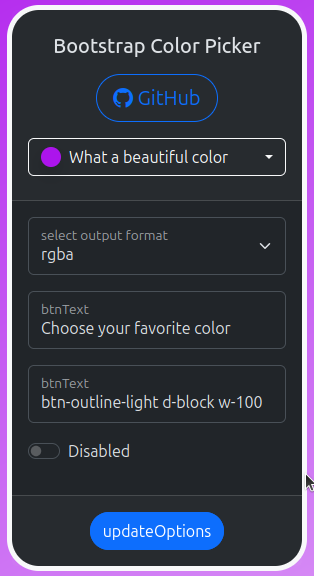

# Bootstrap Color Picker Plugin


A feature-rich and customizable color picker jQuery plugin that seamlessly integrates with Bootstrap 4 or 5.  
This plugin provides an intuitive interface for color selection with support for multiple color formats and
transparency.



## Features

- Full color spectrum selection with saturation and value controls
- Interactive hue and opacity sliders
- Multiple color format support (HEX, RGB, RGBA, HSL, HSLA, CMYK)
- Real-time color preview
- Customizable button styling
- Bootstrap 4 and 5 compatible
- Support for transparency/opacity
- Responsive design
- Touch-device friendly

## Dependencies

- jQuery ^3
- Bootstrap ^4 | ^5
- Bootstrap Icons ^1 (optional)

## Installation
1. Install the package via Composer:

```shell
composer require webcito/bs-color-picker
````
2Include the required dependencies in your HTML:

```html
<!-- Bootstrap CSS -->
<link href="vendor/twbs/bootstrap/dist/css/bootstrap.min.css" rel="stylesheet">

<!-- Bootstrap Icons -->
<link href="vendor/twbs/bootstrap-icons/font/bootstrap-icons.css" rel="stylesheet">

<!-- jQuery -->
<script src="vendor/components/jquery/jquery.min.js"></script>

<!-- Bootstrap JS -->
<script src="vendor/twbs/bootstrap/dist/js/bootstrap.bundle.min.js"></script>

<!-- Bootstrap Color Picker -->
<script src="dist/bs-color-picker.min.js"></script>
```

3Create an input element in your HTML:

```html
<input type="text" id="colorPicker">
```

## Usage

### Basic Implementation

```javascript
$('#colorPicker').bsColorPicker();
```


## Configuration Options


```javascript
$('#colorPicker').bsColorPicker({
    btnClass: 'btn-outline-secondary', // The classes for the dropdown button
    btnText: null, // Button-Text
    btnEmptyColor: 'rgba(0, 0, 0, 0.5)', // The color for the button when no active color is found.
    format: 'rgba', // The output format, which is to be transferred to the input element.
    disabled: false, // Set the dropdown enabled or disabled.
    icons: { // icons for the action buttons
        check: 'bi bi-check-lg', // the color takes over from the picker to the element.
        reset: 'bi bi-arrow-clockwise', // reset the color to the condition when opening the dropdown
        close: 'bi bi-x-lg', // closes the color picker without a change
        empty: 'bi bi-trash3' // Sets the color to null
    },
    debug: false // Activates some useful debugion formations in the Windows.console
});
```

## Global Methods

```javascript
// Set default options for all instances:
$.bsColorPicker.setDefaults({
    btnClass: 'btn-primary',
    format: 'hex',
    ...
});
// Gives back the current default options for the color-picker.
$.bsColorPicker.getDefaults(); // :object
// Gives the permitted format back
$.bsColorPicker.utils.getValidOutputFormates(); // :array
// Check a format for validity
$.bsColorPicker.utils.isValidOutputFormat('rgb'); // :boolean
// Formats a color string in the possible color formats as an object
$.bsColorPicker.utils.convertColorFormats('red'); // :array
// Check whether a value is empty
$.bsColorPicker.utils.isValueEmpty(null); // :boolean
// Gives back an object with all the color names
$.bsColorPicker.utils.getColorNames(); // :object {{'colorName': 'hexValue'}, ...}
// gibt die Farbe im Format hex zurück
$.bsColorPicker.utils.colorNameToHex('red'); // :null|string p.e. #ff0000
```

## Plugin methods

```javascript
$('#colorPicker').bsColorPicker('val'); // get the value in output format -> #ff0000
$('#colorPicker').bsColorPicker('val', 'red'); // set a color
$('#colorPicker').bsColorPicker('getColor'); // return a set of colors for the selected color
$('#colorPicker').bsColorPicker('updateOptions', { btnText: 'beautiful color :)'}); // update options
$('#colorPicker').bsColorPicker('destroy'); // destroy the picker
```

## Events

The plugin triggers the following events:

```javascript
$('#colorPicker')
    .on('change.bs.colorPicker', function (e, data) {
        // Fires when the value of the input changes.
        // Data is the selected color in the output format as a string or null if no color is present
    })
    .on('update.bs.colorPicker', function (e, data) {
        // Fires at every color change in the color picker.
        // Data is an object with all available color formats of the current color.
    })
    .on('all.bs.colorPicker', function () {
        // Fires additionally at every event
    })
    .on('error.bs.colorPicker', function (e, data) {
        logEvent('error.bs.colorPicker', data);
    })
    .on('init.bs.colorPicker', function () {
        logEvent('init.bs.colorPicker');
    })
    .on('show.bs.colorPicker', function () {
        logEvent('show.bs.colorPicker');
    })
    .on('shown.bs.colorPicker', function () {
        logEvent('shown.bs.colorPicker');
    })
    .on('hide.bs.colorPicker', function () {
        logEvent('hide.bs.colorPicker');
    })
    .on('hidden.bs.colorPicker', function () {
        logEvent('hidden.bs.colorPicker');
    })
    .on('reset.bs.colorPicker', function (e, data) {
        logEvent('reset.bs.colorPicker', 'details on console');
        if (data) {
            setBodyGradient(data.rgba);
        }
        console.log('reset.bs.colorPicker', data);
    })
    .on('cancel.bs.colorPicker', function (e, data) {
        logEvent('cancel.bs.colorPicker', 'details on console');
        const colorSet = colorPicker.bsColorPicker('getColor');
        console.log('cancel.bs.colorPicker', data);
        setBodyGradient(colorSet ? colorSet.rgba : null);

    })
    .on('empty.bs.colorPicker', function (e, data) {
        logEvent('empty.bs.colorPicker', data);
        setBodyGradient(null);
    });
```


## Browser Support

- Chrome (latest)
- Firefox (latest)
- Safari (latest)
- Edge (latest)
- Opera (latest)

## Contributing

As this is a proprietary plugin, please contact the project maintainers for information about contributing.

## License

This project is proprietary software. All rights reserved.

## Support

For support, feature requests, or bug reports, please contact the development team.
